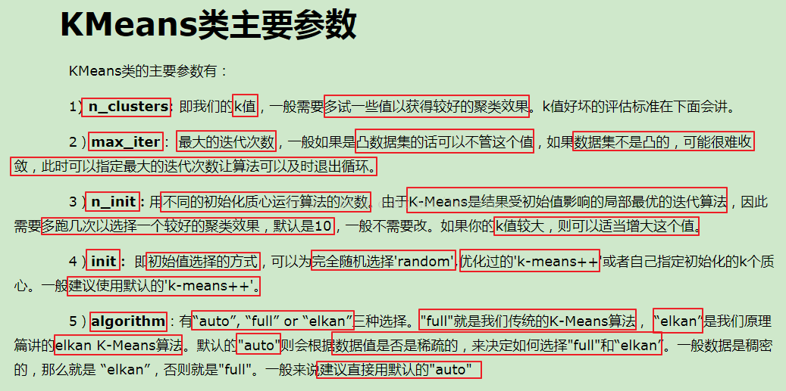

### 各模型的优缺点(参考许佬)

+ ### K-means
	K-means算法的优缺点
	缺点：
	1. K值是用户给定的，在进行数据处理前，K值是未知，不同的K值得到的结果也不一样（易局部最优）
	2. 对初始簇中心是敏感的
	3. 不适合发现非凸形状的簇或者大小差别较大的簇
	4. 离群值（outlier）对模型影响比较大
	优点：
		1.易理解，聚类效果不错
		2.处理大数据集时，该算法可以保证较好的伸缩性和高效率
		3.当簇近似高斯分布的时候，效果不错
		
	要点：
	1. 注意k值的选择，一般会对数据的先验经验选择合适的k值，如果没有先验知识，则可以通过交叉验证选择合适的k值
	2. 在确定k之后，需要选择k个初始化聚类中心，选择会对最后的聚类结果和运行时间都有很大的影响，中心之间不能太近

	参数：
	
	
	参考博客：https://blog.csdn.net/loveliuzz/article/details/78783773

+ ### Linear Regression
	优点：
	1.建模速度快，运行速度快
	2.模型的可解释性好
	缺点：
	1.对异常值敏感
	2.无法拟合复杂的非线性关系
+ ### Logistic Regression
	优点：
	1.形式简单，模型可解释性很好，如果某个特征的权重特别大，那么代表这个特征对结果的影响很大，这个特征非常重要
	2.模型效果不错，特征工程做的好，在工程上都是可以接受的；特征工程可以大家并行开发，提高开发速度
	3.训练速度快，计算量只和特征的数目相关；并且逻辑回归的分布式优化 sgd 发展较为成熟，训练的速度通过分布式优化进一步提高
	4.资源占用小，只存储各个特征对应的权重
	5.方便调整输出结果，即阈值的调整
	缺点：
	1.准确率并不是很高。因为形式非常的简单(非常类似线性模型)，很难去拟合数据的真实分布
	2.处理非线性数据较麻烦。逻辑回归在不引入其他方法的情况下，只能处理线性可分的数据，或者进一步说，处理二分类的问题。
	3.逻辑回归本身无法筛选特征。有时候，我们会用 gbdt 来筛选特征，然后再上逻辑回归
+ ### KNN
	优点：
	1.理论成熟，思想简单，既可以用来做分类也可以用来做回归
	2.可用于非线性分类
	3.KNN 理论简单，容易实现
	缺点：
	1.样本不平衡问题，效果差
	2.需要大量内存
	3.对于样本容量大的数据集计算量比较大（体现在距离计算上）
	4.KNN每一次分类都会重新进行一次全局运算
+ ### SVM
	优点：
	1.对于高维度数据非常有效
	2.当特征数量多余训练数据时，表现依然非常好
	3.当类别是完全可分的时候，是最好的算法
	4.泛化错误率低
	5.计算开销小，虽然循环计算子问题多，但是每个子问题都是解析求解，速度快
	6.能够处理非线性特征的相互作用，将输入空间映射到特征空间的过程中可能发生特征之间的组合
	缺点：
	1.对参数调节和核函数的选择过敏感
	2.对噪声和缺失数据敏感
+ ### Naive Bayes
	优点：
	1.源于古典数学理论，有稳定的分类效率
	2.对小规模数据表现较好，能处理多分类任务；适合增量式训练，尤其是数据量超出内存时，可以一批批地去增量训练
	3.对缺失数据不敏感
	缺点：
	1.在实际应用过程中，属性个数往往较多或者属性之间相关性较大，则过于违背特征独立性假设，导致分类效果不好
	2.需要知道先验概率，且先验概率很多时候取决于假设，若假设的模型不合适，则会导致预测效果不佳
	3.对输入数据的表达形式很敏感，输入数据的表达形式若较为接近则也会影响特征独立性假设
